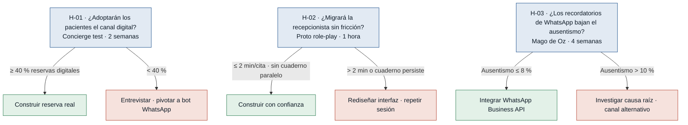
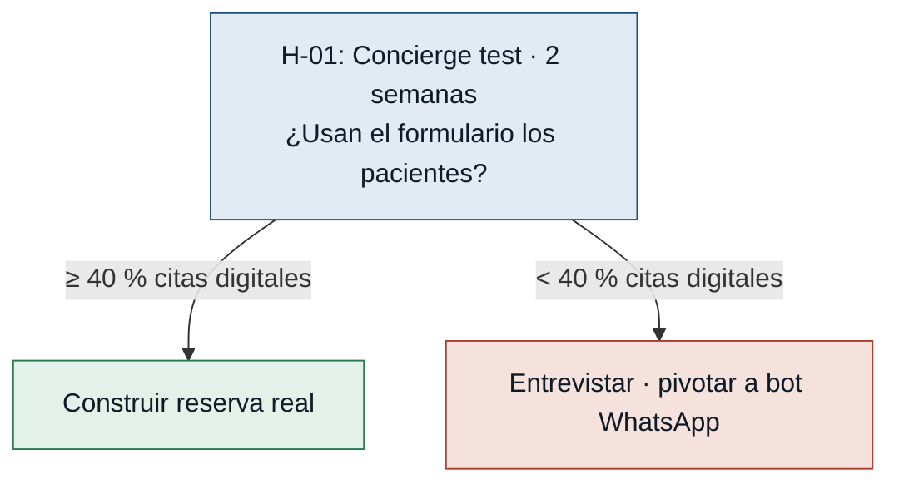
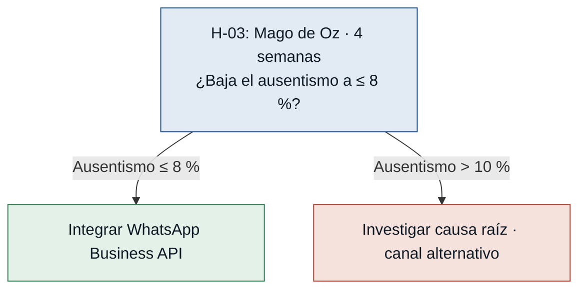

# Hipótesis y experimentos — citaSalud

Supuestos riesgosos del MVP Canvas convertidos en hipótesis falsables,
ordenados de mayor a menor riesgo. La lógica: **primero se prueba lo que
más puede tumbar el MVP**, y cada experimento es el test **más barato** que
responde la pregunta antes de construir.

---

## Árbol de decisión global

---

### [H-01] Adopción digital del paciente — riesgo: **alto**

> El bloque completo del MVP depende de que los pacientes elijan el canal
> digital. Si no lo hacen, el sistema no reduce llamadas ni libera a la
> recepcionista.

- **Supuesto a probar:** Los pacientes (incluyendo adultos mayores) elegirán
  reservar por la plataforma digital en lugar de llamar o ir en persona.
- **Hipótesis:** Creemos que los pacientes agendarán ≥ 40 % de las nuevas
  citas vía canal digital si se les ofrece un formulario de reserva simple,
  porque el principal freno actual es la imposibilidad de llamar en horario
  laboral, no la falta de disposición digital. *(Fuente: paciente.md,
  recepcionista.md)*
- **Señal medible:** Porcentaje de nuevas citas agendadas vía canal digital
  sobre el total de citas agendadas (digitales + telefónicas + presenciales)
  durante el piloto.
- **Criterio de éxito:** ≥ 40 % de las nuevas citas agendadas online al
  finalizar la semana 4 del piloto.
- **Experimento:** Concierge test — la recepcionista comparte con pacientes
  recurrentes un formulario Google (nombre, fecha, horario deseado); ella
  gestiona la reserva manualmente. Los pacientes no saben qué hay detrás.
  Se registra el canal de cada cita agendada durante 2 semanas.
- **Caja de tiempo / costo:** 2 semanas · $0 (Google Forms gratuito; tiempo
  de recepcionista ya contratado).
- **Regla de decisión:**
  - Si pasa (≥ 40 % de citas vía form) → canal digital validado; proceder
    a construir la reserva real.
  - Si falla (< 40 %) → entrevistar a los pacientes que no usaron el form
    para identificar la barrera concreta; pivotar hacia asistencia híbrida
    (bot de WhatsApp que guía la reserva paso a paso) antes de lanzar el
    MVP completo.

---

### [H-02] Migración operativa de la recepcionista — riesgo: **alto**

> La recepcionista es la administradora de la agenda. Sin su adopción, el
> sistema coexiste con el cuaderno, los dobles registros persisten y el
> problema se duplica.

- **Supuesto a probar:** La recepcionista abandonará el cuaderno físico + Excel
  y usará el sistema digital como única fuente de verdad de la agenda.
- **Hipótesis:** Creemos que la recepcionista adoptará el sistema si el flujo
  de registro de una cita es igual o más rápido que el proceso actual, porque
  su resistencia proviene de la pérdida de velocidad operativa, no del rechazo
  a la tecnología en sí. *(Fuente: recepcionista.md)*
- **Señal medible:** Tiempo promedio para registrar una cita con el prototipo
  del sistema vs. el proceso actual con cuaderno/Excel, medido en sesiones de
  observación controlada.
- **Criterio de éxito:** El registro con el sistema tarda ≤ 2 minutos por
  cita Y la recepcionista no recurre al cuaderno paralelo después del día 3
  de uso.
- **Experimento:** Prototipo desechable (Figma o papel) + sesión de role-play
  de 1 hora: la recepcionista registra 5 citas ficticias con think-aloud.
  Se cronometra cada paso y se anotan los puntos de fricción verbalizados.
- **Caja de tiempo / costo:** 3 días (1 de diseño del prototipo, 1 de sesión,
  1 de análisis) · $0 (Figma free / papel + bolígrafo).
- **Regla de decisión:**
  - Si pasa (≤ 2 min/cita y sin cuaderno paralelo desde el día 3) → flujo
    de recepcionista viable; construir con confianza.
  - Si falla (> 2 min o cuaderno paralelo persiste) → identificar los pasos
    lentos con el log de think-aloud, rediseñar esos pasos y repetir la
    sesión antes de iniciar el desarrollo.

```mermaid
flowchart TD
  classDef test fill:#E2EAF3,stroke:#1A4E8A,color:#0E1A26;
  classDef ok   fill:#E3F1E8,stroke:#2E7D52,color:#0E1A26;
  classDef no   fill:#F6E2DD,stroke:#B3402F,color:#0E1A26;

  H["H-02: Role-play prototipo · 1 hora\n¿Registra en ≤ 2 min sin cuaderno paralelo?"]:::test
  H -->|"≤ 2 min/cita · sin cuaderno"| K["Construir con confianza"]:::ok
  H -->|"> 2 min o cuaderno persiste"| V["Rediseñar interfaz · repetir sesión"]:::no
```

---

### [H-03] Recordatorio WhatsApp reduce ausentismo — riesgo: **medio**

> El ausentismo es el dolor declarado con mayor impacto económico para la
> médica. Si el recordatorio por WhatsApp no lo baja, la propuesta de valor
> pierde una de sus palancas principales.

- **Supuesto a probar:** Los recordatorios automáticos por WhatsApp bajarán el
  ausentismo de 15 % a ≤ 8 %, y el canal es accesible para la clínica.
- **Hipótesis:** Creemos que el ausentismo bajará de 15 % a ≤ 8 % si los
  pacientes reciben un recordatorio por WhatsApp 24 h antes de su cita,
  porque el problema declarado es el olvido, no la falta de intención de
  asistir. *(Fuente: doctora.md, paciente.md)*
- **Señal medible:** Tasa de ausentismo: citas confirmadas que no se presentan
  / total de citas confirmadas en el período de piloto.
- **Criterio de éxito:** Tasa de ausentismo ≤ 8 % al cabo de 4 semanas de
  recordatorios activos (línea base declarada: 15 %).
- **Experimento:** Mago de Oz (4 semanas): la recepcionista envía manualmente
  un mensaje de WhatsApp Business a cada paciente confirmado 24 h antes de su
  cita. Se lleva un registro de asistencia vs. ausentismo. No se integra la
  API de WhatsApp; se valida el efecto antes de pagar la integración.
- **Caja de tiempo / costo:** 4 semanas · 10-15 min/día de recepcionista ·
  $0 (WhatsApp Business gratuito).
- **Regla de decisión:**
  - Si pasa (ausentismo ≤ 8 % en las 4 semanas) → efecto del recordatorio
    validado; invertir en integración de WhatsApp Business API.
  - Si falla (ausentismo > 10 % pese al recordatorio) → investigar la causa
    raíz con entrevistas a los que faltaron (transporte, costo de consulta,
    etc.); evaluar canal alternativo (llamada corta de confirmación) o
    replantear el supuesto de que el olvido es la causa principal.

---

## Resumen

| # | Hipótesis | Riesgo | Experimento | Costo |
|---|---|---|---|---|
| H-01 | Pacientes adoptan canal digital | **alto** | Concierge test · 2 sem. | $0 |
| H-02 | Recepcionista migra sin fricción | **alto** | Role-play prototipo · 1 h | $0 |
| H-03 | WhatsApp baja ausentismo a ≤ 8 % | **medio** | Mago de Oz · 4 sem. | $0 |

**Total: 3 hipótesis.** La hipótesis #1 por riesgo es **H-01** (adopción digital
del paciente): si los pacientes no usan el canal digital, el MVP no reduce
llamadas ni libera a la recepcionista, y toda la propuesta de valor colapsa.
El experimento que la ataca primero es el **concierge test con formulario Google**,
que cuesta $0 y puede dar respuesta en 2 semanas antes de escribir una línea de
código.
