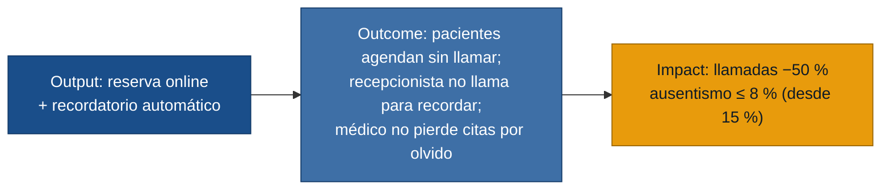

# MVP Canvas — citaSalud

---

| Bloque | Contenido |
|---|---|
| **Propuesta de valor** | Agenda digital que permite al paciente reservar sin llamar, garantiza unicidad del slot en tiempo real y envía recordatorios automáticos por WhatsApp, eliminando las dobles reservas, la saturación telefónica y el ausentismo por olvido. |
| **Segmento de usuarios** | Pacientes recurrentes con horario laboral (no pueden llamar en horario de oficina) · Recepcionista de la clínica (gestora de la agenda). |
| **Funcionalidades mínimas** | 1. Reserva de cita online (autoservicio para el paciente) · 2. Bloqueo en tiempo real del slot confirmado · 3. Recordatorio automático por WhatsApp 24 h antes · 4. Vista de agenda para el médico (solo lectura, desde celular) · 5. Registro manual de citas por la recepcionista (canal presencial/telefónico). |
| **Resultado esperado (outcome)** | Los pacientes reservan sin llamar; la recepcionista deja de gestionar recordatorios manuales y de resolver conflictos de doble reserva; el médico consulta su agenda sin depender de recepción. |
| **Métrica de éxito** | ① Reducción ≥ 50 % en llamadas de agendamiento/consulta de disponibilidad en los primeros 60 días. ② Tasa de ausentismo ≤ 8 % al cabo de 60 días (vs. 15 % actual declarado). — *Prueba ácida: si (①) baja, la recepcionista recupera ~1 h diaria para atención presencial → decisión de negocio inmediata. Si (②) baja, la médica tiene más citas reales → decide abrir más horarios o reducir jornada. Ambas métricas generan acción concreta.* |
| **Riesgos / supuestos** | • Los pacientes (incluyendo adultos mayores) adoptarán el canal digital en lugar de llamar. *(sin validar)* · • La clínica puede costear e integrar WhatsApp Business API para los recordatorios. *(sin validar)* · • La recepcionista migrará del cuaderno + Excel al sistema sin resistencia operativa significativa. *(sin validar)* |
| **Fuera de alcance (por ahora)** | • **Control de disponibilidad del médico (R-05):** la médica dicta sus bloques a la recepcionista; se prioriza el flujo del paciente en la primera iteración. · • **Motivo de consulta al agendar (R-06):** añade fricción al flujo core; se evalúa en la segunda iteración una vez adoptado el canal. · • **Cancelaciones y reprogramaciones online (R-07):** útil, pero no es el cuello de botella más urgente; la recepcionista puede gestionarlas manualmente en esta etapa. · • **Dashboard de indicadores para el dueño de la clínica:** sin entrevista de primera mano; sus necesidades exactas son desconocidas y no se pueden priorizar sin evidencia. · • **App móvil nativa:** se construye web responsive primero; la app nativa se decide según adopción. |
