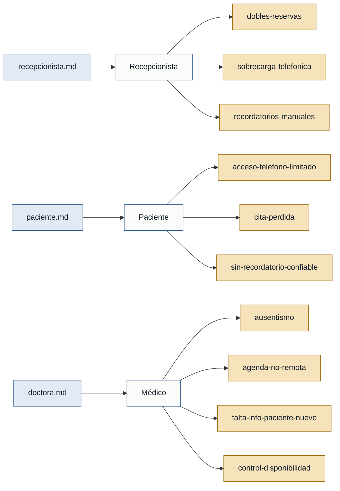

# Personas y Stakeholders — citaSalud

---

## Personas

### Recepcionista — gestión de agenda
- **Contexto:** Administra la agenda de la clínica, atiende llamadas y coordina las citas del día.
- **Objetivo principal:** Que la agenda sea coherente y no genere conflictos ni llegadas frustradas.
- **Dolores:**
  - Dobles reservas por desincronización entre el cuaderno y el Excel (~2 veces/semana). (recepcionista.md)
  - Un tercio de las llamadas son solo consultas de disponibilidad, interrumpiéndola cuando atiende en persona. (recepcionista.md)
  - Llamar uno a uno a ~30 pacientes para recordarles le consume ~1,5 h cada tarde; cuando no alcanza, el ausentismo sube. (recepcionista.md)
- **Respaldo:** `primera mano` — recepcionista.md

---

### Paciente — usuario que agenda citas
- **Contexto:** Paciente recurrente (control mensual) que trabaja en horario de oficina y depende del teléfono para agendar.
- **Objetivo principal:** Sacar y confirmar citas sin perder tiempo ni correr el riesgo de que desaparezcan.
- **Dolores:**
  - Solo puede llamar en su hora de almuerzo; el teléfono a veces está ocupado; ha necesitado 4 intentos para una cita. (paciente.md)
  - Llegó a la clínica y su cita no constaba en el cuaderno; esperó 2 horas. (paciente.md)
  - Los recordatorios son inconsistentes; pierde el papelito físico; prefiere un aviso por WhatsApp. (paciente.md)
- **Respaldo:** `primera mano` — paciente.md

---

### Médico — propietario de la disponibilidad
- **Contexto:** Médico de consulta general que define cuándo abre agenda y cómo se organiza su tiempo.
- **Objetivo principal:** Que su agenda sea productiva, sin huecos por ausentismo y consultable desde cualquier lugar.
- **Dolores:**
  - Calcula un 15 % de inasistencia; ese tiempo muerto priva a otros pacientes de campo. (doctora.md)
  - No puede ver su agenda fuera de la clínica sin llamar a recepción. (doctora.md)
  - Los pacientes nuevos llegan sin información previa; pierde parte de la consulta averiguando el motivo. (doctora.md)
  - Necesita controlar su disponibilidad (bloqueos por congresos, vacaciones) sin depender de la recepcionista. (doctora.md)
- **Respaldo:** `primera mano` — doctora.md

---

## Stakeholders

### Dueño de la clínica
- **Interés en el sistema:** Observar los indicadores de la clínica (ocupación de agenda, ausentismo, ingresos) para tomar decisiones de negocio.
- **Fuente:** recepcionista.md ("el dueño de la clínica mira los números, pero con él casi no hablo").

> **Advertencia:** el dueño de la clínica aparece solo `referenciado` (mencionado por la recepcionista). No hay entrevista de primera mano de este rol. Sus intereses específicos son desconocidos más allá de "mirar los números".
