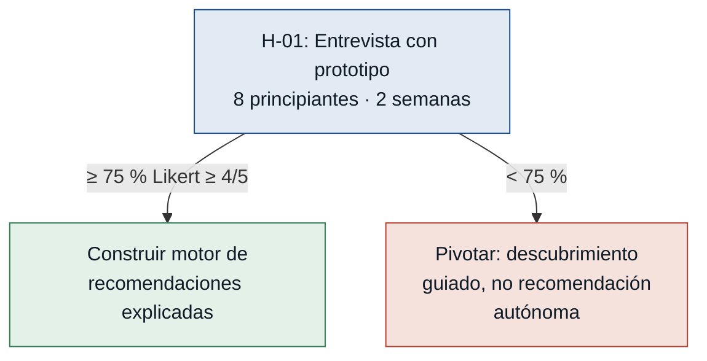
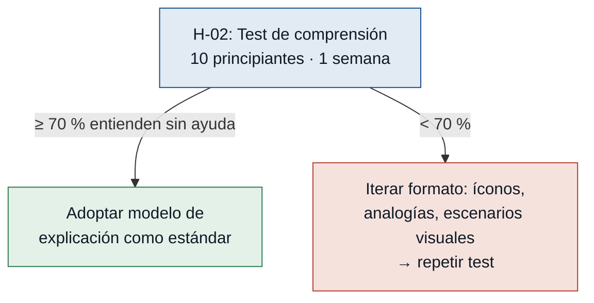
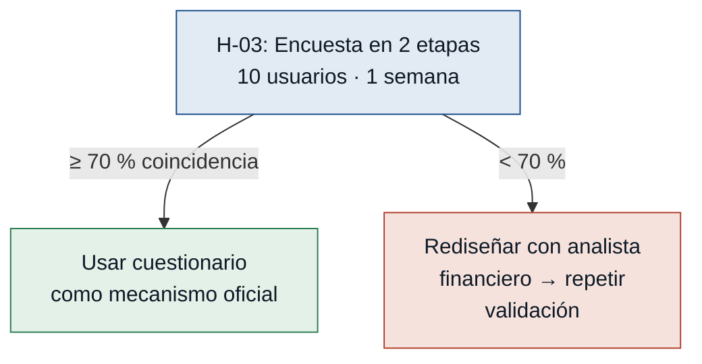
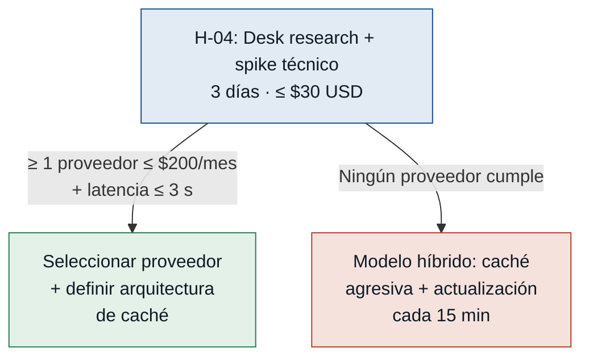

# Hipótesis y experimentos — InvestSmart

> Ordenadas de mayor a menor riesgo. Se prueba primero lo que más puede tumbar
> el MVP. Todas las hipótesis son falsables: tienen umbral concreto y regla de
> decisión que contempla el fallo.

---

### [H-01] Confianza del principiante en recomendaciones algorítmicas — riesgo: alto

- **Supuesto a probar:** Los inversores principiantes están dispuestos a usar una recomendación generada por un algoritmo como base para una decisión de inversión real, aun sin conocer al equipo detrás del producto.
- **Hipótesis:** Creemos que el inversionista principiante consultará la recomendación del sistema como insumo principal para decidir **si** el sistema explica claramente qué variables usó y muestra el riesgo en términos de pérdida posible en monto concreto, porque el mayor freno declarado es el miedo a equivocarse sin información suficiente. *(newUser.md · manager.md)*
- **Señal medible:** % de participantes que, tras ver el prototipo de recomendación explicada, declaran intención de usarla como base para una decisión real (escala Likert ≥ 4/5).
- **Criterio de éxito:** ≥ 75 % (6 de 8 participantes) dentro de las 2 primeras semanas.
- **Experimento:** Entrevista de usabilidad con prototipo de baja fidelidad (Figma o papel). Mostrar a 8 inversores principiantes dos versiones de una recomendación — una sin explicación y una con explicación completa, nivel de riesgo y pérdida posible en monto. Preguntar intención de uso en escala Likert y razón de la respuesta.
- **Caja de tiempo/costo:** 2 semanas · $0 de desarrollo (prototipo de baja fidelidad).
- **Regla de decisión:** Si pasa → construir el motor de recomendaciones explicadas como funcionalidad #1 del MVP. Si falla → pivotar hacia un modelo de descubrimiento guiado (el usuario elige activos, el sistema evalúa y advierte) antes de ofrecer recomendaciones autónomas; no construir el motor hasta validar el nuevo modelo.

---

### [H-02] Comprensibilidad de la explicación en lenguaje simple — riesgo: alto

- **Supuesto a probar:** Una explicación de 2-3 oraciones en lenguaje cotidiano es suficiente para que un principiante sin conocimientos financieros entienda por qué se le recomienda un activo y el riesgo concreto que implica.
- **Hipótesis:** Creemos que el inversionista principiante comprenderá el nivel de riesgo y la razón de una recomendación **si** el sistema la presenta en lenguaje cotidiano con un ejemplo de pérdida expresado en monto concreto, porque declaró explícitamente que abandona la aplicación cuando usa demasiadas palabras técnicas o no explica el porqué. *(newUser.md)*
- **Señal medible:** % de participantes que identifican correctamente el nivel de riesgo y el motivo de la recomendación sin pedir ayuda ni mostrar confusión observable.
- **Criterio de éxito:** ≥ 70 % (7 de 10 participantes) responden correctamente sin facilitación activa dentro de la primera semana.
- **Experimento:** Test de comprensión sin facilitación: mostrar a 10 inversores principiantes la pantalla de recomendación con la explicación en lenguaje simple y pedirles que expliquen con sus palabras qué les está diciendo el sistema y qué harían. Se registra si identifican correctamente el nivel de riesgo y el motivo principal.
- **Caja de tiempo/costo:** 1 semana · $0 (sesiones remotas vía Zoom o Google Meet).
- **Regla de decisión:** Si pasa → adoptar el modelo de explicación como estándar de escritura para todas las recomendaciones del MVP. Si falla → iterar el formato antes de construir: probar con íconos de riesgo, analogías cotidianas o comparación visual de escenarios; repetir el test con el nuevo formato antes de avanzar al desarrollo.

---

### [H-03] Validez del cuestionario de perfil de riesgo — riesgo: medio

- **Supuesto a probar:** Un cuestionario de 5-7 preguntas sobre horizonte de inversión, tolerancia a pérdidas y capital disponible clasifica correctamente el perfil de riesgo de un usuario en función de sus decisiones reales.
- **Hipótesis:** Creemos que el perfil de riesgo derivado del cuestionario coincidirá con el perfil que el propio usuario se atribuye **si** las preguntas presentan escenarios concretos de pérdida (p. ej. "¿Qué harías si tu inversión baja 20 %?") en lugar de preguntas abstractas sobre "tolerancia al riesgo", porque los escenarios concretos reducen el sesgo de deseabilidad social. *(financeAnalytics.md · manager.md)*
- **Señal medible:** Tasa de coincidencia entre el perfil asignado automáticamente por el cuestionario y el perfil que el usuario se asigna a sí mismo después de leer las descripciones de los tres perfiles.
- **Criterio de éxito:** ≥ 70 % de coincidencia en una muestra de 10 usuarios de perfiles variados, dentro de 1 semana.
- **Experimento:** Encuesta en dos etapas (Google Forms): primero el cuestionario con escenarios concretos (el sistema asigna un perfil); luego se muestran las descripciones de los tres perfiles (conservador/moderado/agresivo) y el usuario se autoclasifica. Se comparan ambas respuestas.
- **Caja de tiempo/costo:** 1 semana · $0 (Google Forms gratuito, muestra de conveniencia).
- **Regla de decisión:** Si pasa → usar el cuestionario como mecanismo oficial de perfil en el MVP. Si falla → rediseñar las preguntas con el analista financiero (financeAnalytics.md) para incluir más escenarios concretos y repetir la validación antes de implementar.

---

### [H-04] Viabilidad de costos de APIs financieras — riesgo: medio

- **Supuesto a probar:** Existe al menos una API de datos financieros con cobertura suficiente (acciones, crypto, ETFs), latencia ≤ 3 s y costo mensual ≤ 200 USD para los primeros 100-500 usuarios del MVP.
- **Hipótesis:** Creemos que el equipo podrá integrar datos de mercado confiables y dentro del presupuesto **si** evalúa al menos tres proveedores de API financiera y prototipa la integración con el de mejor prospecto, porque existen múltiples proveedores con planes starter o freemium adecuados para escala inicial. *(devArchitect.md)*
- **Señal medible:** Costo mensual proyectado a 500 usuarios activos consultando 5 activos por día, y latencia real medida en el spike técnico.
- **Criterio de éxito:** Al menos 1 proveedor con costo ≤ 200 USD/mes para 500 usuarios y latencia ≤ 3 s en el 90 % de las consultas desde la región objetivo, validado en un spike de 3 días.
- **Experimento:** Desk research de 3 proveedores (Alpha Vantage, Polygon.io, Yahoo Finance vía RapidAPI) + spike técnico de 2 días integrando el de mejor prospecto: medir latencia real desde la región objetivo y proyectar el costo según volumen estimado.
- **Caja de tiempo/costo:** 3 días · ≤ $30 USD (plan de prueba de la API evaluada).
- **Regla de decisión:** Si pasa → seleccionar el proveedor y definir la arquitectura de caché desde el inicio del desarrollo. Si falla → evaluar modelo híbrido con caché agresiva y menor frecuencia de actualización (intervalos de 15 min); no lanzar con datos en tiempo real si el costo no es sostenible a escala MVP.

---

## Resumen del tablero de experimentos

| ID | Supuesto | Riesgo | Experimento | Plazo | Costo |
|---|---|---|---|---|---|
| H-01 | Confianza en recomendaciones algorítmicas | **Alto** | Entrevista con prototipo (8 personas) | 2 semanas | $0 |
| H-02 | Comprensibilidad de la explicación simple | **Alto** | Test de comprensión sin facilitación (10 personas) | 1 semana | $0 |
| H-03 | Validez del cuestionario de perfil de riesgo | Medio | Encuesta en dos etapas (10 personas) | 1 semana | $0 |
| H-04 | Viabilidad de costos de APIs financieras | Medio | Desk research + spike técnico | 3 días | ≤ $30 USD |

> **Secuencia recomendada:** H-02 y H-04 se pueden correr en paralelo (ninguna requiere la otra). H-01 depende de contar con el prototipo de recomendación, que a su vez depende de conocer el formato de explicación (H-02). Sin embargo, H-01 puede correr con un formato provisional si se acepta iterarlo después.
