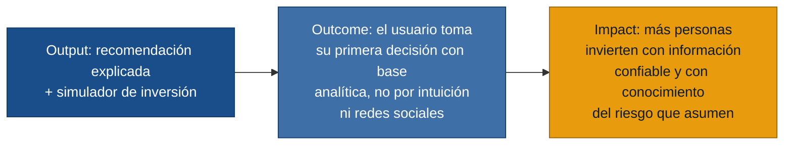

# MVP Canvas — InvestSmart

## Cadena de valor

---

## Canvas

| Bloque | Contenido |
|---|---|
| **Propuesta de valor** | Permitir a cualquier persona — sin importar su nivel de experiencia financiera — tomar decisiones de inversión más informadas mediante recomendaciones personalizadas, explicadas en lenguaje simple y calibradas a su perfil de riesgo. |
| **Segmento de usuarios** | Inversionistas principiantes con capital disponible que hoy deciden en base a redes sociales o consejos de amigos. Como segmento secundario: inversionistas experimentados que buscan consolidar análisis en una sola herramienta. |
| **Funcionalidades mínimas** | 1. Registro con autenticación segura (US-01) · 2. Cuestionario de perfil de riesgo (US-01) · 3. Consulta de datos de mercado vía API externa (US-05) · 4. Recomendación automática con explicación en lenguaje simple, nivel de riesgo y escenario de pérdida (US-02) · 5. Detalle técnico de la recomendación para usuario avanzado (US-04) · 6. Simulador básico de inversión (US-03) · 7. Advertencias y disclaimers obligatorios en cada recomendación (US-07) |
| **Resultado esperado (outcome)** | Que al menos una parte de los usuarios que reciben una recomendación tomen una decisión de inversión (o descarten activamente) usando esa recomendación como insumo principal, en lugar de basarse en fuentes no analíticas. |
| **Métrica de éxito** | **% de usuarios activos que ejecutan al menos una simulación de inversión a partir de una recomendación en sus primeros 7 días.** Objetivo inicial: ≥ 40 %. *Prueba ácida: si sube, el equipo puede decidir invertir más en mejorar el motor de recomendaciones; si cae, puede pivotar hacia onboarding más guiado o recomendaciones más simples.* |
| **Riesgos / supuestos** | 1. Los usuarios principiantes confiarán en recomendaciones algorítmicas sin conocer al equipo detrás (deseabilidad no validada). · 2. Las APIs de datos financieros tendrán costos y límites de consumo manejables a escala inicial (viabilidad técnica). · 3. Una explicación breve en lenguaje simple será suficiente para que el principiante entienda la recomendación (usabilidad). · 4. El perfil de riesgo capturado por cuestionario reflejará fielmente el perfil real del usuario (validez del instrumento). |
| **Fuera de alcance (por ahora)** | Indicadores técnicos configurables por el usuario (R-09) — complejidad innecesaria para el principiante, puede validarse con el experimentado después. · Comparación multi-activo en una sola vista (R-10) — aumenta el alcance técnico sin resolver el dolor principal. · Guardado de estrategias personalizadas (R-11) — función de retención, no de adquisición. · Señales combinadas avanzadas (R-12) — requiere validar primero que el motor básico genera confianza. · Alertas de mercado en tiempo real (US-06) — infraestructura costosa; se prioriza después de validar el uso de recomendaciones. |

---

## Historias que componen este MVP

| Story | Persona | Requisitos cubiertos |
|---|---|---|
| US-01 Registro y perfil de riesgo | Principiante · Experimentado | R-01, R-02 |
| US-02 Recomendación explicada en simple | Principiante | R-04, R-05, R-06 |
| US-03 Simulador de inversión | Principiante | R-07 |
| US-04 Detalle técnico de la recomendación | Experimentado | R-05, R-12 (parcial) |
| US-05 Consulta de datos de mercado | Experimentado | R-03, R-16 |
| US-07 Advertencias de riesgo persistentes | Ambos | R-06, R-13 |

> US-06 (alertas) queda en backlog inmediato, no en el MVP.

---

## Notas de arquitectura para el MVP

Los requisitos no funcionales R-14 a R-20 aplican desde la primera versión. El
arquitecto (devArchitect.md) advierte explícitamente: no depender de una única
API de mercado, cachear el último dato válido y notificar al usuario cuando los
datos no estén frescos. Estos comportamientos están incluidos en US-05 y son
condición de entrega del MVP, no mejoras futuras.
