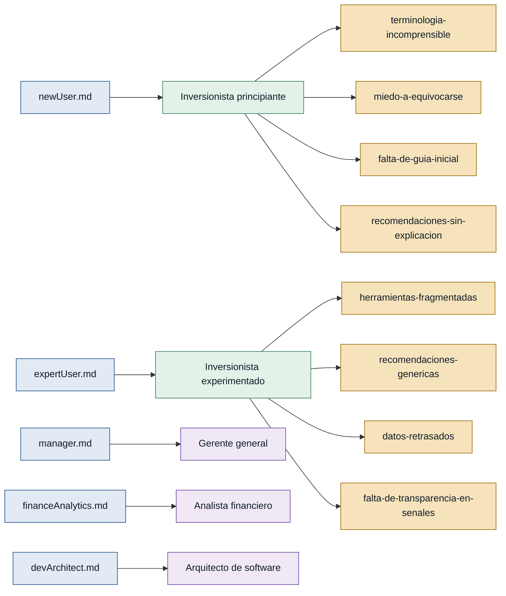

# Personas y Stakeholders — InvestSmart

## Personas

### Inversionista principiante — usuario sin experiencia financiera
- **Contexto:** persona que quiere iniciarse en inversiones pero carece de conocimiento técnico y teme cometer errores.
- **Objetivo principal:** entender en qué invertir, cuánto arriesgar y obtener recomendaciones simples y justificadas sin necesidad de conocimientos previos.
- **Dolores:**
  - No entiende gráficos ni terminología financiera; las plataformas le resultan abrumadoras. (newUser.md)
  - Siente miedo de equivocarse y perder dinero. (newUser.md)
  - No sabe cuándo comprar, cuándo vender ni cuánto capital destinar. (newUser.md)
  - Abandona la herramienta si recibe recomendaciones sin explicación del porqué. (newUser.md)
- **Respaldo:** `primera mano` — entrevista propia en newUser.md.

---

### Inversionista experimentado — analista independiente con experiencia en trading
- **Contexto:** persona que ya opera en mercados financieros, usa indicadores técnicos y necesita herramientas integradas para no dispersarse entre múltiples plataformas.
- **Objetivo principal:** consolidar en un solo lugar el análisis técnico, las alertas y la comparación de activos, con transparencia sobre las señales generadas.
- **Dolores:**
  - Debe saltar entre varias herramientas para ver indicadores, comparar activos y gestionar alertas. (expertUser.md)
  - Las plataformas no integran el análisis; los datos están pero no se combinan. (expertUser.md)
  - Las recomendaciones son genéricas y no explican las variables utilizadas. (expertUser.md)
  - Los datos retrasados hacen inutilizable el sistema para tomar decisiones oportunas. (expertUser.md)
- **Respaldo:** `primera mano` — entrevista propia en expertUser.md.

---

## Stakeholders

### Gerente general
- **Interés en el sistema:** que el producto ayude a personas a invertir con más confianza e información, con métricas de adopción (frecuencia de uso, simulaciones realizadas).
- **Fuente:** manager.md

### Analista financiero
- **Interés en el sistema:** que las recomendaciones sean transparentes, incluyan nivel de riesgo y posible pérdida, y cuenten con advertencias legales claras para no interpretarse como asesoría garantizada.
- **Fuente:** financeAnalytics.md

### Arquitecto de software
- **Interés en el sistema:** que la arquitectura sea resiliente ante fallos de APIs externas, tenga alta disponibilidad, baja latencia, autenticación segura y trazabilidad de logs.
- **Fuente:** devArchitect.md

---

## Mapa de trazabilidad

> **Verde** = persona con respaldo de primera mano · **Ámbar** = referenciada (ninguna en este discovery) · **Violeta** = stakeholder

